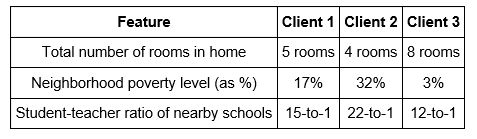
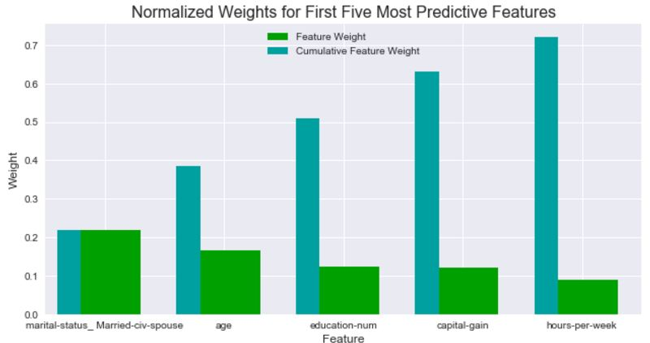
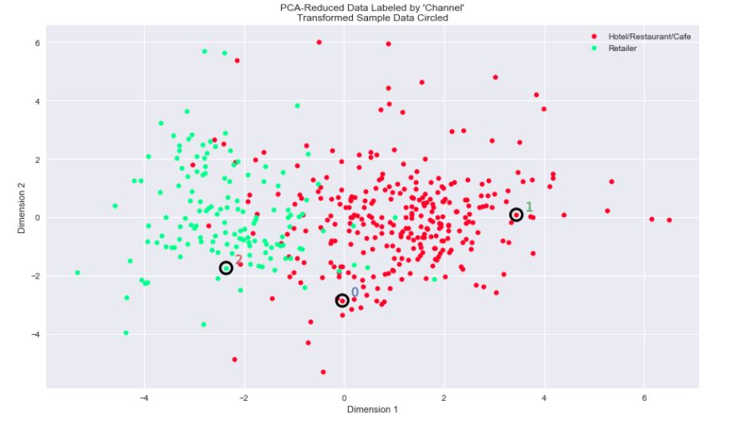

# Udacity- Machine Learning Nanodegree

 <a href="https://www.udacity.com/course/machine-learning-engineer-nanodegree--nd009">
The Nanodegree's website</a> 

### This nanodegree covers:
- Supervised Learning
- Unsupervised Learning
- Reinforcement Learning
- Deep Learning

### Projects
- [x] [Project 1: Predicting Boston Housing Prices (Supervised Learning)](https://github.com/Sally-Ng/MLND-Predicting_Boston_Housing_Prices)
- [x] [Project 2: Finding Donors for CharityML (Supervised Learning)](https://github.com/Sally-Ng/Udacity-Finding_Donors_for_Charity)
- [x] [Project 3: Creating Customer Segments (Unsupervised Learning)](https://github.com/Sally-Ng/MLND-Creating_Customer_Segments)
- [ ] Project 4: Train a Smartcab to Drive (Reinforcement Learning)
- [ ] Project 5: Dog Breed Classifier (Deep Learning)
- [ ] Project 6: Capstone Project

### Courses
- Machine Learning Foundations
- Supervised Learning
- Unsupervised Learning
- Reinforcement Learning
- Deep Learning
- Machine Learning Capstone

 
 

[Project 1: Predicting Boston Housing Prices](https://github.com/Sally-Ng/MLND-Predicting_Boston_Housing_Prices)  
Language: Python (scikit-learn, pandas, NumPy)   
Skills: Machine Learning, Data Exploration  
Built Supervised Machine Learning model to estimate the best selling price of houses in Boston, Massachusetts. Distinguished the Decision Tree model preforms the best with a maximum depth of 4.   

  

[Project 2: Finding Donors for Charity](https://github.com/Sally-Ng/Udacity-Finding_Donors_for_Charity)  
Language: Python (scikit-learn, pandas, NumPy)   
Skills: Machine Learning, Data Exploration, Data Visualization  
Compared the accuracy of the SVM, Decision Tree and Naïve Bayes models on distinguishing potential donors. Optimized the model with GridSearchCV and preformed features selection to reduce training time.

  

[Project 3: Creating Customer Segments](https://github.com/Sally-Ng/MLND-Creating_Customer_Segments)  
Language: Python (scikit-learn, pandas, NumPy, matplotlib, seaborn)   
Skills: Machine Learning, Data Exploration, Data Visualization  
Created a K-Means clustering model to segment customers based on their spending on varies products. Implemented feature scaling for data normalization and PCA for dimensionality reduction

  

